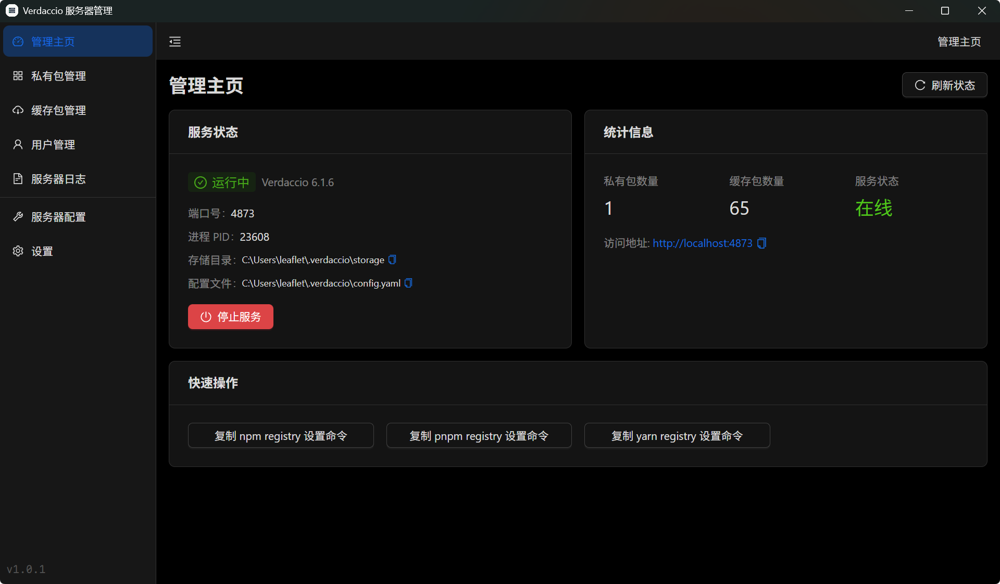
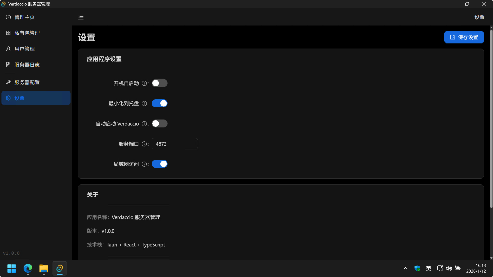
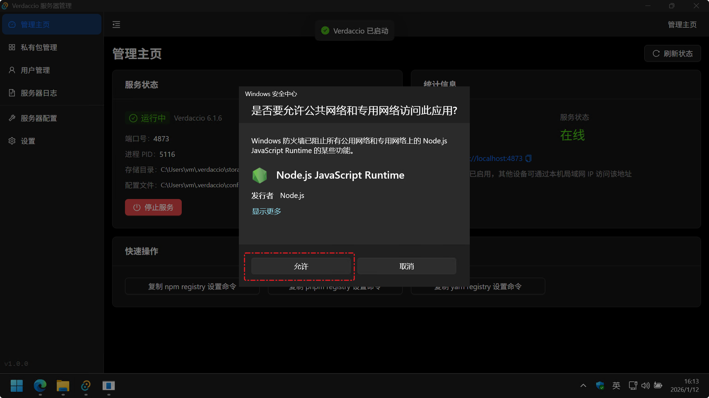

## Verdaccio Server Manager

适用于 Windows 平台的 Verdaccio 服务器管理程序



> Collaborate with AI.

### 功能

- 集成 Verdaccio，开箱即用，无需配置
- 内置包管理与用户管理功能
- 内置服务器配置文件编辑器
- 支持自定义 Verdaccio 端口、开放局域网访问
- 支持开机自启、服务自启以及任务栏图标显示运行状态

### 如何使用

从 release 页面下载打包好的exe，双击安装即可。

当首次启动 Verdaccio 服务时，默认不允许局域网访问。你可以在设置中开启局域网访问：



当开启局域网访问后，需要重启服务才能生效。重启服务后当出现如下授权时，**请务必选择“允许”**！



### 已知问题

- 服务器日志“自动滚动”无效
- 打包似乎包含了一堆不需要的node_modules

### 二次开发

```shell
# fork & clone 仓库到本地

# 安装所有依赖
pnpm install
# 初始化vardaccio运行环境
pnpm prepare:runtime
# 运行开发预览服务
pnpm tauri dev

# 构建与分发
pnpm tauri build
# 构建产物位于 src-tauri/target/release/bundle 目录下
```

### 相关信息

- [Verdaccio](https://github.com/verdaccio/verdaccio)
- [Tauri](https://github.com/tauri-apps/tauri)
